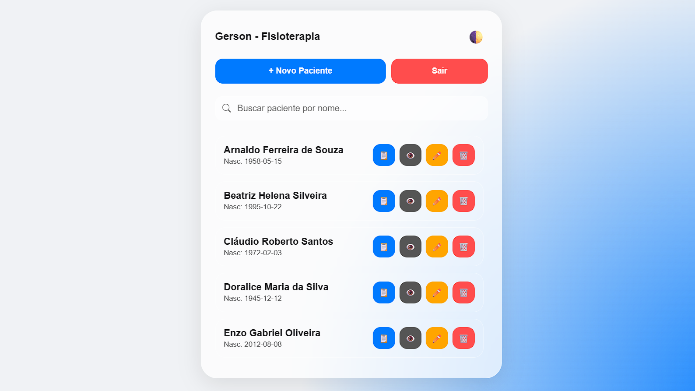

# 🩺 Clínica de Fisioterapia

Sistema de gerenciamento de pacientes e avaliações fisioterapêuticas com design moderno inspirado no iOS (Glassmorphism).

## 🌐 Visualize o Projeto Online

Para visualizar o projeto em funcionamento, clique no link abaixo:
👉 **[Clínica de Fisioterapia Online](https://clinica-fisioterapia.onrender.com/)**

> **Acesso rápido:** > - **Usuário:** `Gerson`
> - **Senha:** `123456`
> 
> *Você também pode criar um novo usuário clicando em "Registrar" na tela inicial.*
---

## 📸 Preview do Sistema

---

## 🚀 Tecnologias Utilizadas
- **Node.js** & **Express** (Backend)
- **Lowdb** (Persistência de dados em JSON)
- **HTML5/CSS3/JS** (Frontend nativo com Glassmorphism)
- **Mobile First** (Otimizado para tablets e celulares)

---

## 📋 Funcionalidades
- [x] Cadastro e Edição de Pacientes.
- [x] Sistema de busca em tempo real.
- [x] Ficha de Avaliação Fisioterapêutica completa.
- [x] Histórico detalhado de avaliações por paciente.
- [x] Modo Escuro (Dark Mode) automático.
- [x] Sistema de Login e Registro de usuários.

---

## 🛠️ Como rodar o projeto localmente
1. Certifique-se de ter o [Node.js](https://nodejs.org/) instalado.
2. Clone o repositório.
3. No terminal, execute: `npm install`
4. Inicie o servidor: `node server.js`
5. Acesse: `http://localhost:3000`

---
Desenvolvido como projeto de portfólio para a área de Análise e Desenvolvimento de Sistemas.